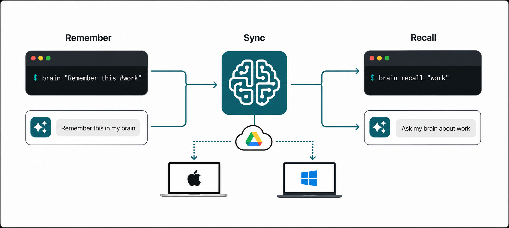

[](https://twitter.com/deanthecoder)

# Brain

**Remember from any terminal. Sync across computers. Recall with the CLI or Codex.**



Brain is a fast, cross-platform memory store for facts, decisions, people, links, files, and todos. Capture a thought in one command, find it later from any connected computer, or simply ask Codex what your Brain knows.

```bash
brain "@Erica says 16-bit support is not needed for PLAT-123"
brain recall "16 bit"
```

With the Codex skill installed, use natural requests such as **"Remember this in my brain"** and **"Ask my brain about 16-bit support."**

## Why Brain?

- **Effortless command-line capture:** remember something without choosing a document, opening an app, or organizing it first.
- **Private cross-machine sync:** connect Google Drive once on each computer; Brain uses its hidden application-data folder and needs no user API setup.
- **Flexible recall:** search from the terminal by text, person, tag, reference, URL, or entry ID.
- **AI integration:** Codex can add, recall, review, tag, and tidy memories when you refer to "my brain."
- **Portable local data:** memories remain readable JSON files, while attachments are stored as deduplicated binary blobs.

## Install

Download the installer for your platform from [GitHub Releases](https://github.com/deanthecoder/Brain/releases):

- Windows: `Brain-<version>-win-x64.exe`
- Apple Silicon Mac: `Brain-<version>-osx-arm64.dmg`
- Intel Mac: `Brain-<version>-osx-x64.dmg`

Run the installer, then open a new terminal. The `brain` command will be available on your path.

## Remember and Recall

Remember a thought directly or with the explicit `add` command:

```bash
brain "My wife loves getting flowers"
brain add "@Bob recommended Google Drive for Brain"
brain 'This is my standard developer logo @file:"/Users/me/Pictures/developer-logo.png"'
```

Search and browse your memories:

```bash
brain recall "flowers"
brain recall "#dean-coding-style" --count 10
brain recent
brain recent 20
brain people
brain tags
brain todos
```

`brain tags` displays tag counts in columns up to 80 characters wide. Use `--json` for structured tag data.

## Attach Files

Add one or more small files to a memory with `@file:`. Brain immediately copies each file into its own storage, so the original can later be moved or deleted:

```bash
brain 'My standard developer logo @file:"/Users/me/Pictures/developer-logo.png"'
brain 'Brand assets @file:logo.png @file:"logo dark.png"'
```

PowerShell users can wrap the complete memory in single quotes:

```powershell
brain 'My standard developer logo @file:"C:\My Files\developer-logo.png"'
```

Recall output shows attachment names and entry IDs. List or extract attachments with:

```bash
brain attachments
brain extract <entry-id>
brain extract <entry-id> --to <folder>
```

Attachments are limited to 10 MB each and stored once by content hash, even when several memories use the same file. When the final referencing memory is forgotten, Brain retains the attachment for 30 days before automatically pruning it after a successful Drive pull. Preview or run cleanup manually with `brain attachments prune --dry-run` and `brain attachments prune`.

Recall returns every matching entry by default. An exact entry ID recalls that entry directly. Add `--count <number>` (or `-count <number>`) when you only want the highest-ranked matches. Output includes each entry's ID; use it to forget something:

```bash
brain forget 88e961720efc3bcf
```

Forgotten entries are synchronized as tombstones, so another computer will not restore them.

Export active memory text and metadata to a readable JSON file for backup or use with another tool:

```bash
brain export brain-backup.json
```

The JSON export includes attachment metadata and hashes, but not the binary attachment blobs. Connected attachments remain backed up in Brain's private Google Drive application-data folder.

## Sync with Google Drive

Connect each computer once:

```bash
brain drive connect
```

Brain opens Google's consent screen and requests access only to its private application-data folder. After connection, Brain pushes memories and referenced attachments after capture and periodically pulls changes before reads.

Useful sync commands:

```bash
brain drive status
brain drive sync
brain drive disconnect
```

Use `--offline` when a command should not synchronize.

`brain drive status` reports the last successful pull and push, plus the most recent synchronization error when one is pending.

## Use Brain with Codex

The included Codex skill recognizes the phrase **"my brain"**. Once installed, try:

- "Ask my brain what we decided about iOS."
- "Check my brain for anything Bob said about installers."
- "Add to my brain: the next release should be version 0.2."
- "Remember in my brain that Erica owns PLAT-123."
- "Review my brain and suggest duplicates or unclear memories."

Ask Codex to install the public skill directly from this repository:

> Install the Brain skill from `https://github.com/deanthecoder/Brain/tree/main/skills/brain`.

Alternatively, clone the repository and copy `skills/brain` into `~/.codex/skills/brain`. Start a new Codex task after installation so the skill is discovered.

The skill requires the `brain` command to be installed on the same computer as Codex. It uses Brain's JSON output and never edits the storage files directly. Reviews check for duplicates, unclear memories, and inconsistent or missing tags; they remain read-only until you approve specific changes.

## Conventions

Brain derives useful metadata from clear signals while leaving ambiguous notes alone:

- Remembering the same text again, ignoring letter case, returns the existing entry instead of creating a duplicate.
- `@Erica` identifies a person. Later mentions of Erica are recognized automatically.
- `#todo` marks a todo.
- `#tag` categorizes a thought. Tags are stored separately and shown in bold in console results.
- `@file:<path>` copies a file into Brain and attaches it to the memory; quote paths containing spaces.
- Entries containing a URL are automatically tagged `url`, so `brain recall "#url"` lists remembered links.
- `PLAT-123`-style values are recorded as references.
- Phrases such as `my wife` can imply personal context.
- URLs with or without a protocol, plus email addresses, are captured as metadata.

These hints are deterministic; Brain does not use AI to rewrite or reinterpret stored text.

## Command Reference

```text
brain <text>                 Remember a thought
brain add <text>             Remember a thought
brain recall <query> [--count <number>]
                             Search remembered thoughts
brain recent [count]         Show recent thoughts
brain people                 Show known people
brain tags                   Show known tags and entry counts
brain attachments            Show stored attachments
brain attachments prune [--dry-run]
                             Prune attachments orphaned for 30 days
brain todos                  Show remembered todos
brain forget <id>            Forget an entry
brain extract <id> [--to <folder>]
                             Extract an entry's attachments
brain export <file>          Export active entries as JSON
brain path                   Show the storage path
brain drive connect          Connect Google Drive
brain drive sync             Synchronize now
brain drive status           Show connection status
brain drive disconnect       Forget the Google connection
```

Global options accept one or two dashes:

- `--json` emits machine-readable JSON.
- `--offline` skips automatic synchronization.
- `--home <path>` uses a different storage directory.

In PowerShell, quote text and queries containing `@`, for example `brain recall "@Erica"`.

## Storage

Run `brain path` to display the storage location for the current installation. Each thought is an immutable JSON file. Attachments are immutable binary blobs named by SHA-256 content hash; entry JSON stores only their metadata and hash.

Google Drive synchronization uses Brain's private `appDataFolder`. The refresh token is stored in Brain's per-user settings. Brain uses a bundled Desktop OAuth client with PKCE; users do not need environment variables or Google developer credentials.

## Build from Source

Brain targets .NET 8 and uses the `DTC.Core` and `DTC.Installer` submodules.

```bash
git clone --recurse-submodules https://github.com/deanthecoder/Brain.git
cd Brain
dotnet build Brain.sln
dotnet test Brain.sln
```

Build platform installers from the repository root with:

```bash
python Installer/pack.py
```

## Philosophy

Capturing a thought should be faster than deciding where to put it.

## License

MIT © Dean Edis. See `LICENSE` for details.
